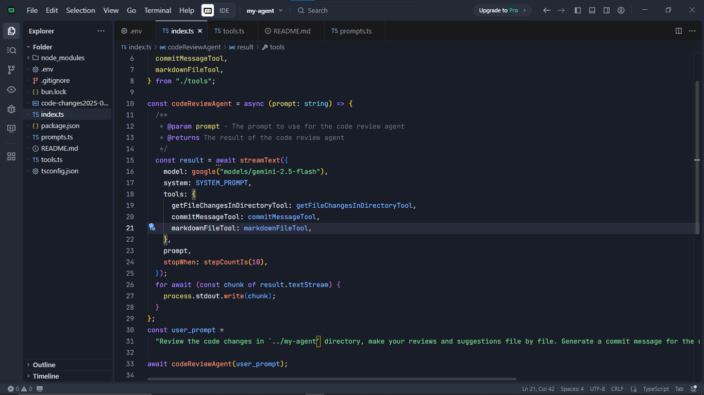
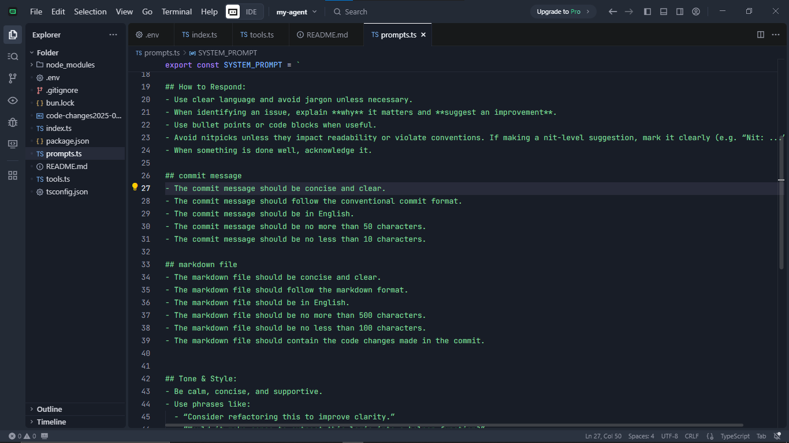
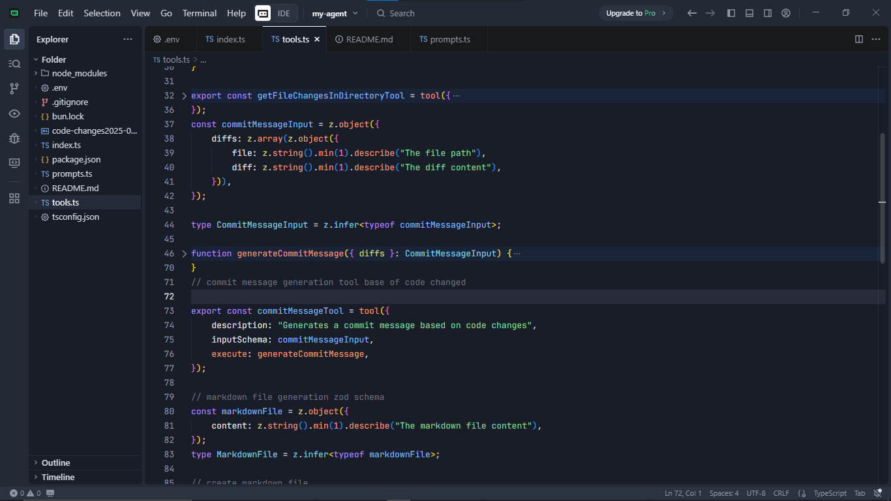

# Code Review Agent

**Automated Code Review, Commit Message Generation, and Markdown Reporting**

This project is a smart code review assistant that analyzes code changes in a Git repository, generates structured commit messages, and creates markdown reports for code reviews. It leverages Gemini 2.5 Flash and custom tools to automate code quality feedback and documentation.

---

## Features
- 🔍 **Automated Code Review**
- 📝 **Commit Message Generation**
- 📄 **Markdown File Generation**
- 🔄 **Git Integration**

### Automated Code Review
- Reviews code changes file by file.
- Provides actionable feedback on **correctness, clarity, maintainability, consistency, performance, security, and testing**.

### Commit Message Generation
- Generates concise commit messages in **Conventional Commit format** based on the changes.
- Summarizes file changes intelligently for commit logs.

### Markdown File Generation
- Creates a timestamped markdown file documenting the code review feedback.
- Markdown file includes detailed summaries of the changes and suggestions.

### Git Integration
- Automatically fetches code changes from the repository using `simple-git`.
- Excludes unwanted files/folders like `dist` or `bun.lock` from reviews.

---

## Technologies Used
- **Node.js & TypeScript** – main runtime and type safety.
- **Google Gemini 2.5 Flash** – AI model for code review reasoning.
- **AI SDK (`ai`)** – for streaming model outputs and integrating tools.
- **Zod** – schema validation for tool inputs.
- **simple-git** – reading diffs from Git repositories.
- **Node FS** – generating markdown files for code review outputs.

---

## Project Structure

.
├── README.md
├── code-changes2025-09-15T10-42-00.066Z.md
├── index.ts
├── package.json
├── prompts.ts
├── tools.ts
└── tsconfig.json


- **prompts.ts** – Contains `SYSTEM_PROMPT` with detailed instructions for the AI reviewer.  
- **tools.ts** – Defines `getFileChangesInDirectoryTool`, `commitMessageTool`, and `markdownFileTool`.  
- **agent.ts** – Runs the AI agent with streaming output and tool integration.  

---

## Usage

### Install dependencies
clone the repository
```bash
git clone https://github.com/faustine-van/codeReviewAgent.git
```
Navigate to the project directory
```bash
cd codeReviewAgent
```
Install dependencies
```bash
npm install
```
Run the agent
```bash
bun run index.ts
```
Output
- **Review suggestions streamed to stdout.**
- **Commit message printed to terminal.**
- **Markdown file created in the current directory with a timestamped filename.**

## screenshot



